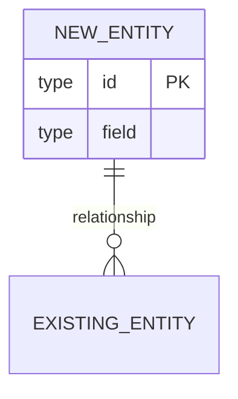
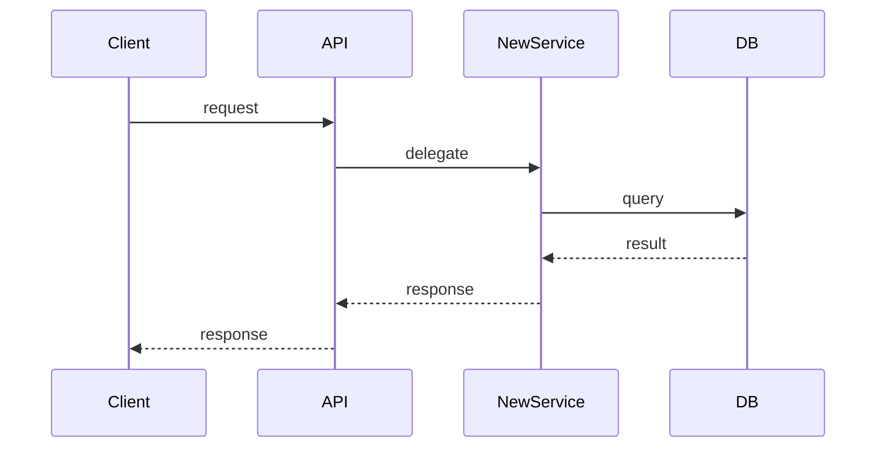

# Prompt: Generate Technical Architecture Delta for Phase [[PHASE_NUMBER]]

> **How to use:**
> 1. Complete prompts 01 and 02 first — this prompt builds on those outputs
> 2. Fill every `[[PLACEHOLDER]]` from `docs/00_intake/phase_intake_questionnaire.md`
> 3. Paste this entire file into your AI tool
> 4. Save the output to `docs/02_outputs/phase[[PHASE_NUMBER]]/03_tech_architecture_delta.md`

---

## Instructions to AI

You are a principal software engineer writing a **Technical Architecture Delta** for Phase [[PHASE_NUMBER]]. Document only the architectural changes, additions, and new components introduced by this phase.

**Critical rule:** Do NOT rewrite the v1 architecture document. Reference it by section name when extending it. Focus entirely on what changes.

**Important:** For every significant architectural decision made in this document, explicitly call it out as an **ADR Candidate** so the developer knows to create an ADR.

If you have file access, read these now:
- `docs/02_outputs/03_tech_architecture.md` (v1 architecture)
- `docs/02_outputs/phase[[PHASE_NUMBER]]/01_prd_delta.md`
- `docs/02_outputs/phase[[PHASE_NUMBER]]/02_functional_spec_delta.md`

---

## v1 Context

**Project name:** [[PROJECT_NAME]]
**Stack (unchanged unless noted below):**
- Backend: [[BACKEND_LANG]] / [[BACKEND_FRAMEWORK]]
- Frontend: [[FRONTEND_FRAMEWORK]]
- Database: [[DATABASE]]
- Auth: [[AUTH_STRATEGY]]
- Deployment: [[DEPLOYMENT_TARGET]]

**Stack changes in this phase:**
[[Fill from phase intake section 2.1 — or "none"]]

**Database changes:**
[[Fill from phase intake section 2.3]]

**New integrations / external services:**
[[Fill from phase intake section 3]]

---

## Phase [[PHASE_NUMBER]] Input

**Phase name:** [[PHASE_NAME]]

**New features:**
[[Fill from phase intake section 1.1]]

**External feature documents:**
[[PHASE_ATTACHMENTS]]
*(AI with file access: read all files in `docs/00_intake/phase[[PHASE_NUMBER]]_attachments/`)*

**New compliance or non-functional requirements:**
[[Fill from phase intake sections 4.1 and 4.2]]

---

## Required Output Sections

### 1. Architecture Change Summary
2–3 sentences: what architectural areas this phase touches and why.

### 2. New or Modified Components
For each new service, module, or component:

```
Component: [name]
Type: [new service / new module in existing service / modified existing component]
Responsibility: [what it does]
Interfaces: [what it exposes or consumes]
ADR candidate: [yes/no — if yes, describe the decision that needs to be recorded]
```

If a v1 component is significantly modified, describe only the delta.

### 3. Data Architecture Delta

#### 3a. New Tables / Collections
For each new entity, show its fields and relationships (ERD fragment in Mermaid):



#### 3b. Changes to Existing Schema
List any additions or modifications to v1 tables/collections:

| Table | Change type | Description |
|-------|-------------|-------------|
| | add column / rename / drop / add index | |

#### 3c. Migration Strategy
How will existing v1 data be migrated or left in place?

### 4. New API Design Patterns *(if any)*
If this phase introduces API patterns not present in v1 (e.g. webhooks, streaming, GraphQL alongside REST), document the pattern here. Individual endpoints are covered in prompt 04.

### 5. New Sequence Diagrams
For each significant new flow, show the component interaction using Mermaid:



### 6. New Auth / Authorization Changes *(if any)*
Describe only what changes from the v1 auth model — new roles, new permission checks, new OAuth scopes, etc.

### 7. Infrastructure & Deployment Changes *(if any)*
New services to provision, environment variables to add, scaling changes, etc.

### 8. Security Considerations
New attack surface introduced by this phase and mitigations.

### 9. ADR Candidates Summary
List every decision in this document that warrants a formal ADR:

| Decision | Why it needs an ADR |
|----------|---------------------|
| | |

Run `make adr SLUG=phase[[PHASE_NUMBER]]-<slug>` for each one after reviewing this document.

---

## Output Format

- Markdown with clear H2/H3 headings
- Use Mermaid for all diagrams
- Target length: 2000–4000 words
- Be opinionated — state what will be built, not what could be built
